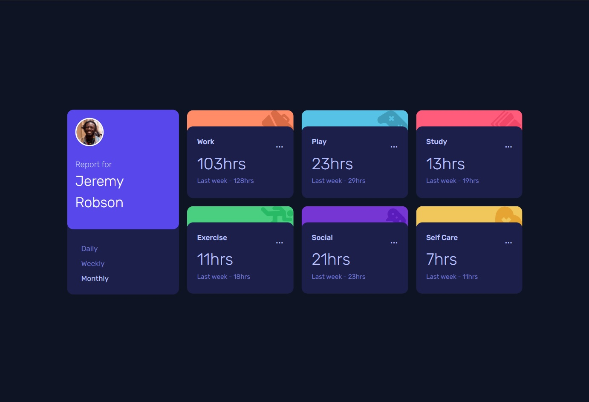

# Frontend Mentor - Time tracking dashboard solution

This is a solution to the [Time tracking dashboard challenge on Frontend Mentor](https://www.frontendmentor.io/challenges/time-tracking-dashboard-UIQ7167Jw). Frontend Mentor challenges help you improve your coding skills by building realistic projects. 

## Table of contents

- [Overview](#overview)
  - [The challenge](#the-challenge)
  - [Screenshot](#screenshot)
  - [Links](#links)
- [My process](#my-process)
  - [Built with](#built-with)
- [Acknowledgments](#acknowledgments)

## Overview
This project was mainly for practising with Javascript. Therefore the CSS is good for given screensizes but not for all screensizes. Time spend to finish the project about 9 hours.

### The challenge

Users should be able to:

- View the optimal layout for the site depending on their device's screen size, build for mobile 360px and desktop 1440px.
- See hover states for all interactive elements on the page
- Switch between viewing Daily, Weekly, and Monthly stats

### Screenshot

### Links

- Solution URL: [Add solution URL here](https://your-solution-url.com)
- Live Site URL: [Add live site URL here](https://your-live-site-url.com)

## My process
Fixing the styling with Sass went easily. The harder part was the Javascripting but didn't run into much problems after all. 
### Built with

- Semantic HTML5 markup
- Sass
- Flexbox
- CSS Grid
- Mobile-first workflow
- Javascript

## Acknowledgments

Much thanks to the awesome frontendmentor.io
